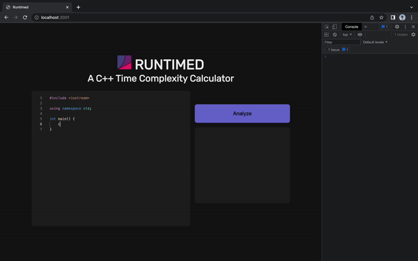
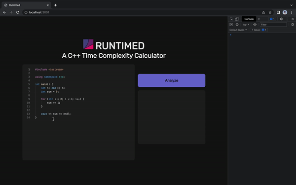
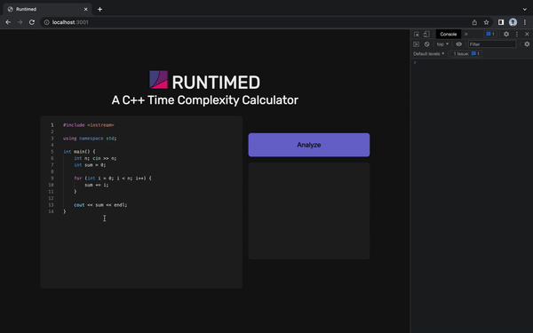

<h1 align="center">
   
    
   
  Runtimed
   
</h1>

<h2 align="center">
A web application (in development) that statistically analyzes the runtime complexity of a C++ program.

</h2>

<h3 align="center">Runtimed takes a user-input C++ function, and runs it with a series of input values in order to plot the output results against a regression model. The r^2 value of the regression then determines the time complexity. Runtimed began as a project for HowdyHack 2022.</h3>

##

  
   The built-in text editor and analysis of a simple cout statement. 

  
   Analysis of a O(n) function. 

  
   Analysis of a O(n^2) function. 

  
   Analysis of a O(n^3) function. 

## Built With 

- [Node.js](https://nodejs.org/en/) - Open-source, back-end Javascript runtime environment used for building web and network applications.
- [Express.js](https://expressjs.com/) - The open-source, go-to Node.js web application framework.
- [Python](https://www.python.org/) - High-level multipurpose programming language.
- [SciPy](https://scipy.org/) - Open-source Python library specializing in scientific and technical computing.

##

**Made By**
 
[**Chris Colling**](https://github.com/HorseNuggets)
[**Jonathan Lor**](https://www.jlor.io/)
[**Hunter Finch**](https://github.com/hfinchy12)
[**Minh Dao Nguyen**](https://github.com/Minh-Dao-Nguyen)
